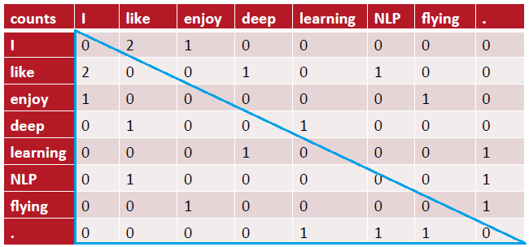
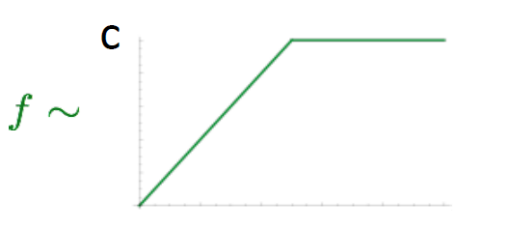
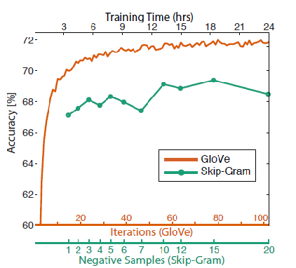

GloVe (Global Vectors for Word Representation) is a model released in
2014 by Stanford NLP Group researchers **Jeffrey Pennington**, **Richard
Socher**, and **Chris Manning** for learning word embedding and
published in the paper: [GloVe: Global Vectors for Word
Representation](https://aclanthology.org/D14-1162.pdf). The GloVe
authors present some results which suggest that their model is
competitive with Google's popular word2vec package.

The key idea behind GloVe model is to combine two concepts into one
model; It learns word vectors by using the same idea of <u>Word2Vec
model</u> beside examining [word <u>co-occurrences</u> within a text
corpus.

Co-occurrence Matrix
--------------------

Before we train the actual model, we need to construct a co-occurrence
matrix $X$, where a cell $X_{\text{ij}}$ represents how often the word
$i$ appears in the context of the word $j$ using a certain window size.
We run through our corpus just once to build the **window-based
co-occurrence** matrix $X$ whose dimension is
$\left| V \right| \times \left| V \right|$. We will construct our model
based only on the values collected in $X$. So, assuming that our corpus
has only three sentences which are "I like deep learning.", "I like
NLP.", and "I enjoy flying." and assuming also that we have a <u>window of
just one word</u>; then our co-occurrence matrix would be:

    

There are a lot of things we should notice looking at this matrix:

-   The co-occurrence matrix is symmetric, which means that the
    co-occurrence count of "I" and "like" is the same as the
    co-occurrence count of "like" and "I".

-   The shape of the matrix is $V \times V$ where $V$ is the size of the
    vocabulary which is $8$ in our case here. So, imagine using a
    million-word vocabulary.

-   There are a lot of zeros in this matrix. So, most of the used
    storage will be just zeros.

To be able to use this matrix in our GloVe model, there are some hacks
that we need to do to this matrix:

-   Words like "the", "he", "she", "and" ...etc. are too frequent, so we
    can <u>limit their count</u> to a certain number, say $100$, or just
    <u>ignore them all</u>.

-   Use Pearson correlations instead of counts, then set negative values
    to $0$.

-   Ramped windows that count closer words more.

Model
-----

As I said before, GloVe models combine **Word2Vec** model with the
**co-occurrence matrix**. So, we can imagine that the GloVe model is a
modification of the Word2Vec model where we use the word-by-word
co-occurrence matrix with word-vectors that we want to train just like
that:

$$w_{i}^{T}.w_{j} + b_{i} + b_{j} = log\left( X_{\text{ij}} \right)$$

Where

-   $i$ and $j$ are the word-pairs.

-   $X_{\text{ij}}$ refers to the co-occurrence count of word $i$ with word $j$.

-   $w_{i}$ and $w_{j}$ are the two word-vectors that we are trying to learn.

-   $b_{i}$ and $b_{j}$ are the biases that we are trying to learn as well.

This formula works well, but we can weigh words differently to derive
more flexibility and robustness like so:

$$\sum_{i,j = 1}^{\left| V \right|}{f\left( X_{\text{ij}} \right)\left( w_{i}^{T}.w_{j} + b_{i} + b_{j} - log\left( X_{\text{ij}} \right) \right)^{2}}$$

Such as that:

-   $\left| V \right|$ is the number of word-pairs in the vocabulary.

-   $f\left( X_{\text{ij}} \right)$ represents a simple function that
    restrict the values of the co-occurrence count. We can use the
    following function:

$$f\left( X_{\text{ij}} \right) = \left\{ \begin{matrix}
\left( \frac{X_{\text{ij}}}{x_{\max}} \right)^{\alpha}\text{if}\ \ X_{\text{ij}} < x_{\max} \\
1\ \ \ \ \ \ \ \ \ \text{otherwise} \\
\end{matrix} \right.$$

Where $x_{\max}$ is called "the cutoff" usually equals to $100$. When we
encounter extremely common word pairs (where
$X_{\text{ij}} > x_{\max}$), this function will simply return $1$. For
all other word pairs, it will return some weight in the range
$\left( 0,1 \right)$, where the distribution of weights in this range is
decided by $\alpha$ which is usually equals to $0.75$.

OR we could use a simpler function like the
$\max\left( X_{\text{ij}},c \right)$ where $c$ is a constant number
(usually $100$).

    

Evaluation
----------

Before talking about how to evaluate our model, let's first take about
the hyper-parameters that can be tuned to get better and better results.
The following graph is from the published GloVe paper:

-   First, Same hyper-parameters as Word2Vec models which are:

    -   Initialization method.

    -   Learning rate $\alpha$.

    -   Word vector dimension $d$. Best value for $d$ is about $300$ and
        it slightly drops-off afterwards. But, it might be different
        for downstream tasks.

    -   Window size $m$. As we can see in the following graph, the best
        value is around $8$.

    -   Using <u>symmetric</u> or <u>Asymmetric</u> windows. Symmetric
        is using the window size for both directions (left and right).
        Asymmetric is using the window size for just one direction.

    

-   Using either <u>co-occurrence count</u> or the <u>Pearson
    correlations</u> instead of counts and set negative values to
    $0$.

-   Training Time (no. of iterations): Usually the more ... the better

    

Now, how to evaluate our model? Let's first talk about how to evaluate
NLP tasks in general. Actually, there are two methods (Intrinsic and
Extrinsic). Intrinsic methods try to find a mathematical formula or a
sub-task to evaluate our model. While Extrinsic methods try to get our
model into a real-life task. Both have some pros and cons:

<table>
    <thead>
        <tr>
            <th></th>
            <th style="text-align:center"><strong>Intrinsic</strong></th>
            <th style="text-align:center"><strong>Extrinsic</strong></th>
        </tr>
    </thead>
    <tr>
        <td><strong>Pros</strong></td>
        <td>
            <ul>
                <li>Fast to compute.</li>
                <li>Very useful when trying to get intuition about the model.</li>
            </ul>
        </td>
        <td>
            <ul>
                <li>Very sufficient in case of good results.</li>
            </ul>
        </td>
    </tr>
    <tr>
        <td><strong>Cons</strong></td>
        <td>
            <ul>
                <li>Not enough to decide if the model is helpful or not.</li>
            </ul>
        </td>
        <td>
            <ul>
                <li>Takes a long time to compute.</li>
                <li>In the case of bad results, it is unclear if the subsystem is the problem or the intrinsic task wasn't properly performed.</li>
            </ul>   
        </td>
    </tr>
</table>

So, let's explain this in more details... Assume that we have a
word-vectors for a $1,000,000$ word vocabulary and we want to evaluate
if these word-vectors are worth publishing or not?? When thinking about
intrinsic evaluation, we might think to get just a $10,000$ words and
test on a word analogy task]. This is fast to compute, and we can
tune some of the parameters to get better and better results. But,
$10,000$ isn't enough, we need to get the whole matrix into
consideration. So, we decided to use the whole $1,000,000$ words into
the same task (word analogy). Putting in mind that such a task might
take hours and hours to train and evaluate. And the results might get
worse as the hyper-parameters that we have tuned are for the $10,000$
task not the whole corpus.

So, the solution is to to balance between these two methods. At first,
we have to start with the intrinsic method and change only one
parameter. And don't confirm this change unless it's evaluated by the
Extrinsic method.

> **Note:**\
We can use a pre-trained GloVe word embedding freely from the Stanford
GloVe official website. We can know a lot about these pre-trained models
from the name, for example the pre-trained model "glove.6B.50d", it's
called 6B because it's formed using 6 billion words in context, and 50d
because the extracted features (dimension) are 50.

Re-training Word Vectors
------------------------

We can always use pre-trained word vectors whether it's Word2Vec
embeddings or GloVe embeddings, but what about use these pre-trained
word vectors as the initial weights of our model?? Is it a good idea??

Actually, that's a great question and the answer is not that simple. But
luckily there is a rule-of-thumb that we can use... if the training
dataset is quite small, then it's so much better if we don't train our
model using these pre-trained vectors. And if the training dataset is
very large, it may work better to train the model using the pre-trained
vectors. And that's because if the dataset is quite small, some of the
word vectors will get better values but not all of them, so the model
loses generalization.

Let's see how... assume that we have a small data corpus where the word
"TV" and "telly" are mentioned and the word "television" is not; then
when training the model using these small dataset, the model changes the
"TV" and "telly" word vectors according to their context. But what about
the word "television\"?? It won't change, which makes its vector less
similar to the vectors of "TV" and "telly" putting in mind that these
three words are the same. So, their pre-trained vectors are pretty
similar. That's why when training a model with small dataset some of the
words are left out, and similar word-vectors becomes less similar.
