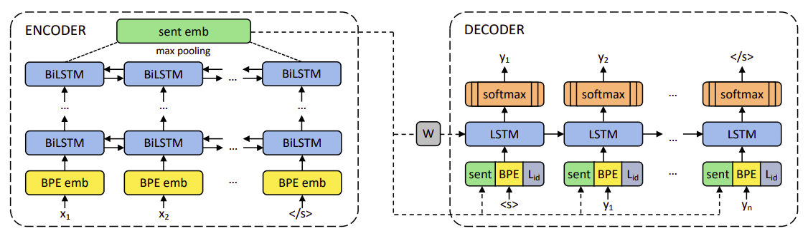

LASER stands for "**L**anguage-**A**gnostic **Se**ntence
**R**epresentation". LASER is an encoder-decoder architecture proposed
by FAIR in 2019 and published in their paper: [Massively Multilingual
Sentence Embeddings for Zero-Shot Cross-Lingual Transfer and
Beyond](https://arxiv.org/pdf/1812.10464.pdf). The official code for
this paper can be found in the Fairseq official GitHub repository:
[fairseq/laser](https://github.com/pytorch/fairseq/tree/main/examples/laser).

LASER was trained on parallel corpora to learn joint multilingual
sentence representations for 93 languages. The encoder is
language-agnostic which maps the source sequence into a fixed-length
vector representation, which is used by the decoder alongside the
language ID embedding $L_{\text{id}}$ to create the target sequence.
This decoder is then discarded, and the encoder is kept to embed
sentences in any of the training languages.

    

In this paper, they studied a stacked BiLSTM with 1 to 5 layers, each
512-dimensional resulting 1024-dimensional sentence representations
(after concatenating both directions). The decoder has always one layer
of dimension 2048. The input embedding size is set to 320, while the
language ID embedding has 32 dimensions.

Training minimizes the cross-entropy loss on the training corpus,
alternating over all combinations of the languages involved. They used
Adam with a constant learning rate of 0.001 and dropout set to 0.1, and
train for a fixed number of epochs.

TO BE CONTINUED
