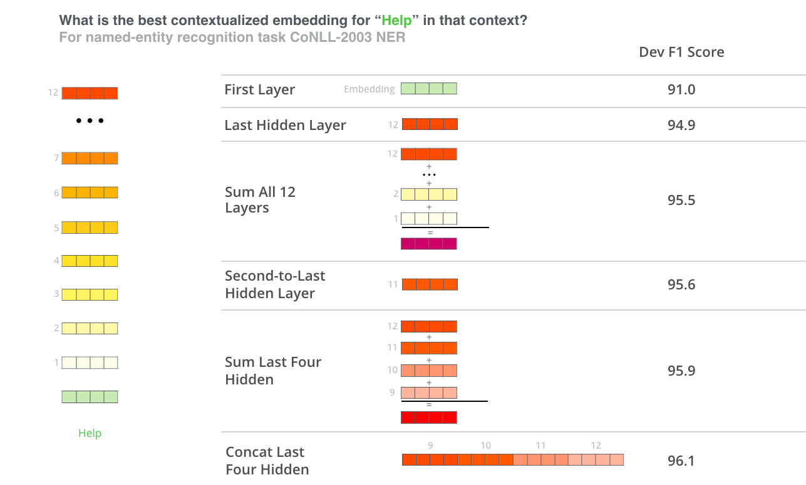

In the past few years, a number of new methods leveraging contextualized
embeddings have been proposed. These are based on the notion that
embeddings for words should be based on contexts in which they are used.
This context can be the position and presence of surrounding words in
the sentence, paragraph, or document.

ELMO
----

ELMO stands for "Embeddings from Language Models" and it is based on a
very important concept which is **contextualized word embeddings**.
Contextualized word embeddings means that: instead of using a fixed
embedding for each word, let's look at the entire sentence before
assigning each word in it an embedding.". So, each word will have a
different embedding based on the context of the sentence.

So, for example the word "Paris", it can be used to describe the city or
it can be a female name like "Paris Hilton" for example. In all previous
word embedding techniques, the word "Paris" wil lhave the same word
embedding for both the city and the name. In ELMO, "Paris" will still
have just one embedding vector where it sums all the multiple embeddings
resulting from the different context the word appeared at.

    

ELMO was published in this paper: "[Deep contextualized word
representations](https://arxiv.org/pdf/1802.05365.pdf)" by "Allen
Institute for AI" in 2018. And ELMO creates these contextualized word
embeddings by using a bi-directional LSTM trained on a massive dataset
to predict the next word in a sequence of words - a task called Language
Modeling. This is convenient because we have vast amounts of text data
that such a model can learn from without needing labels.

    

ELMO comes up with the contextualized embedding from bi-directional LSTM
through the following three steps:

-   Given a word "w", we will concatenate the forward and backward word
    embeddings of each word at every layer. So, in the previous
    architecture, where ELMO has only two layers, we will have three
    sets of vectors:

    -   Concatenate the forward and backward of the "stick" word embeddings.

    -   Concatenate the forward and backward of the first LSTM layer.

    -   Concatenate the forward and backward of the second LSTM layer.

-   Multiply each word vector by learnable parameters that represent the
    importance of that word embedding.

-   Eventually, sum all three weighted vectors together to get just one
    vector.

And all three steps can be summarized in the following image:

    

BERT
----

This part relies heavily on BERT and how it works. So, if you need a
refresher, check the BERT part in the language model document. BERT
stands for "Bidirectional Encoder Representations from Transformers" and
it's a language model architecture that can be fine-tuned for various
tasks. BERT, also, can be used to create contextualized word embeddings
like ELMO as shown in the following figure:

    

According to the paper: "[BERT: Pre-training of Deep Bidirectional
Transf](https://arxiv.org/pdf/1810.04805.pdf)", the output of each
encoder layer along each token's path can be used as a word embedding
for that token. And according to the paper, there are some word vectors
that work best as contextualized word embedding knowing that it might
depend on the task. So, the task the paper used was NER and the
following summarized the results:

    

