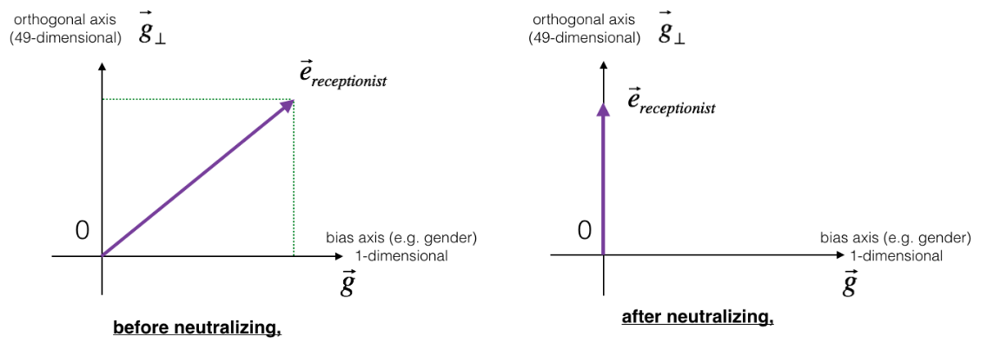
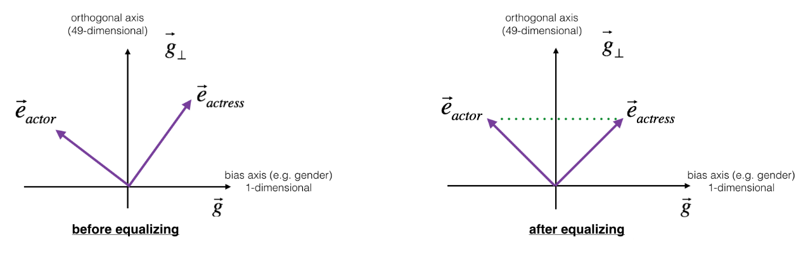

In this paper: [Man is to Computer Programmer as Woman is to Homemaker?
Debiasing Word Embeddings](https://arxiv.org/pdf/1607.06520.pdf) published in
2016, the researchers examined the gender biases that can be reflected in a
word embedding and explore some algorithms for reducing the bias.

First, what does biasing of word vectors really mean? OK, let's put it
that way. There are some words that relate only the females like
"actress, waitress, mother, aunt, ..." and there are some words that
relate only the males like "actor, waiter, father, uncle, ...". And
there some other words that can relate to the two genders like
"programmer, developer, assistant, doctor, ...".

Surprisingly, most of the word embedding that are out there are biasing
towards a certain gender due to the context they were mentioned at.
Let's see the "glove.6B.50d.txt" for example, there are some words that
relate to the female more that the male like "lipstick, arts,
literature, doctor, receptionist, fashion, ...". And let's be honest,
some of them make perfect sense like "lipstick" for example, but there
are also some of them that don't make any sense like "doctor" and
"receptionist" which must be gender unspecific.

We\'ll see how to reduce the bias of these vectors, using an algorithm
due to Boliukbasi 2016. Note that some word pairs such as
\"actor\"/\"actress\" or \"grandmother\"/\"grandfather\" should remain
gender specific, while other words such as \"receptionist\" or
\"technology\" should be neutralized, i.e. not be gender-related. You
will have to treat these two types of words differently when de-biasing.

Implicit Association Test
-------------------------

Implicit Association Test is the test used to check if two sets of words
are biased towards a certain topic or not. And that's how it works;
assume that you have two sets of words that you want to check the bias
between them (they are called attributes):

-   X: {male, man, boy, brother, he, him, his, son}.

-   Y: {female, woman, girl, sister, she, her, hers, daughter}.

Now, let's assume that we have another two sets of words that represent
two opposing topics (they are called target words):

-   A: {math, algebra, geometry, calculus, equations, numbers}.

-   B: {poetry, art, dance, literature, novel, symphony, drama}.

And this can be done via the following formula:

$$s\left( X,Y,A,B \right) = \sum_{x \in X}^{}s\left( x,A,B \right) - \sum_{y \in Y}^{}s\left( y,A,B \right)$$

$$s\left( w,A,B \right) = \frac{1}{\text{card}\left( A \right)}\sum_{a \in A}^{}\cos\left( w,a \right) - \frac{1}{\text{card}\left( B \right)}\sum_{b \in B}^{}\cos\left( w,b \right)$$

Where:

-   $s\left( X,Y,A,B \right)$: is the association test between all words
    of attributes and target words. And it could have three possible
    values:

    -   If the score is **positive**, it means the association between X
        and A is big than Y and B. and the higher the score is, the
        more association there is.

    -   If the score is **negative**, it means the association between Y
        and B is big than X and A. and the lower the score is, the
        more association there is.

    -   If the score is **zero**, it means there are no association
        between X and A and Y and B.

-   $s\left( w,A,B \right)$: is the association strength between word w
    and set A and away from set B.

-   $\text{card}\left( A \right)$: It's the cardinality a set of words A
    which is a measure of a set\'s size, meaning the number of unique
    elements in that set. For instance, the set $A = \{ 1,2,4\}$ has a
    cardinality of $3$ for the three elements that are in it.

Neutralization
--------------

By neutralization, we mean to neutralize the bias for non-gender
specific words. So, the words like "receptionist, doctor, literature,
art, technology, ..." will be gender unspecific. We are going to do that
using some linear algebra concepts like so:

<div align="center">
    
</div>

The figure above should help visualizing what neutralization does. If
you\'re using a 50-dimensional word embedding, the 50-dimensional space
can be split into two parts: The gender-direction $\overrightarrow{g}$,
and the remaining 49 dimensions, which we\'ll call
<span>${\overrightarrow{g}}_{\bot}$</span>. Even though
<span>${\overrightarrow{g}}_{\bot}$</span> is 49 dimensional, given the
limitations of what we can draw on a screen, we illustrate it using a
1-dimensional axis below.


In linear algebra, we say that the 49-dimensional vector
<span>${\overrightarrow{g}}_{\bot}$</span> is perpendicular (or "orthogonal") to
<span>$\overrightarrow{g}$</span>, meaning it is at can NOT be affected by
<span>$\overrightarrow{g}$</span> . The neutralization step takes a vector such as
<span>$e_{\text{receptionist}}$</span> and zeros out the component in the direction
of <span>$\overrightarrow{g}$</span> , giving us
<span>$e_{\text{receptionist}}^{\text{debiased}}$</span>.

$$e_{\text{debiased}} = e_{w} - e_{\text{proj}},e_{\text{proj}} = \frac{e_{w}\text{.g}}{\left\| g \right\|_{2}} \ast g$$

Where $e_{w}$ is the word embedding of a certain word $w$, $g$ is the
gender direction, $e_{\text{proj}}$ is the projection of $e_{w}$ onto
the direction $g$ and finally $e_{\text{debiased}}$ is the de-biased
form of $e_{w}$.

Let's implement a function which can remove the bias of a given word:

```python
def project(A, B):
    return (np.dot(A, B) / np.sum(B**2)) * B

def neutralize(word, g, word_embedding):
    e_w = word_embedding[word]
    e_proj = project(e, g)
    e_debiased = e_w - e_proj
    return e_debiased
```
Now, we can try:

```python
>>> # we can get the gender vector by simply doing so:
>>> g = embedding['women'] - embedding['man']
>>> # cosine similarity before neutralizing:

>>> cosine_similarity(embedding['receptionist'], g))
0.330779417506

>>> e_debiased = neutralize("receptionist", g, embedding)
>>> # cosine similarity after neutralizing:
>>> cosine_similarity(e_debiased, g))
-3.26732746085e-17
```

Equalization
------------

By equalization, we mean to equalize the values of gender-specific words
like "(actress, actor), (father, mother), ...". Equalization is applied
to pairs of words that you might want to have differ only through the
gender property. As a concrete example, suppose that \"actress\" is
closer to \"babysit\" than \"actor.\" By applying neutralizing to
\"babysit\", we can reduce the gender-stereotype associated with
babysitting. But this still does not guarantee that \"actor\" and
\"actress\" are equidistant from \"babysit.\" The equalization algorithm
takes care of this.

The key idea behind equalization is to make sure that a particular pair
of words are equi-distant from the 49-dimensional vector
${\overrightarrow{g}}_{\bot}$. In pictures, this is how equalization
works:

<div align="center">
    
</div>

The derivation of the linear algebra to do this is a bit more complex,
but the key equations are:

$$\mu = \frac{e_{w1} + e_{w2}}{2},\mu_{B} = \text{proj}\left( \mu,{\text{bia}s}_{\text{axis}} \right),\mu_{\bot} = \mu - \mu_{B}$$

$$e_{w1B} = \frac{\sqrt{\left| 1 - \left\| \mu_{\bot} \right\|_{2}^{2} \right|} \ast \text{proj}\left( e_{w1},\text{bias}_{\text{axis}} \right) - \mu_{B}}{\left| \text{proj}\left( e_{w1},\text{bias}_{\text{axis}} \middle| - \mu_{B} \right) \right|}$$

$$e_{w2B} = \frac{\sqrt{\left| 1 - \left\| \mu_{\bot} \right\|_{2}^{2} \right|} \ast \text{proj}\left( e_{w2},\text{bias}_{\text{axis}} \right) - \mu_{B}}{\left| \text{proj}\left( e_{w2},\text{bias}_{\text{axis}} \middle| - \mu_{B} \right) \right|}$$

$$e_{1} = e_{w1B} + \mu_{\bot},e_{2} = e_{w2B} + \mu_{\bot}$$

Let's get to the implantation:

```python
def equalize(pair, bias_axis, word_to_vec_map):
    w1, w2 = pair
    e_w1, e_w2 = word_to_vec_map[w1], word_to_vec_map[w2]
    mu = (e_w1 + e_w2) / 2.
    mu_B = project(mu, bias_axis)
    mu_orth = mu - mu_B
   
    e1_orth = mu_orth
    e2_orth = mu_orth
    
    e_w1B = np.sqrt(np.abs(1 - normalize(mu_orth)**2))\
                * (project(e_w1, bias_axis) - mu_B) \
                / np.linalg.norm(np.abs(project(e_w1, bias_axis) - mu_B))

    e_w2B = np.sqrt(np.abs(1 - normalize(mu_orth)**2)) \
                * (project(e_w2, bias_axis) - mu_B) \
                / np.linalg.norm(np.abs(project(e_w2, bias_axis) - mu_B))
    
    e1 = e_w1B + e1_orth
    e2 = e_w2B + e2_orth
    return e1, e2
```

Now, let's see it in action

```python
>>> # cosine similarities before equalizing:
>>> cosine_similarity(embedding['man'], g))
-0.117110957653

>>> cosine_similarity(embedding['man'], g))
0.356666188463

>>> e1, e2 = equalize(('man', 'woman'), g, embedding)
>>> # cosine similarities after equalizing:
>>> cosine_similarity(e1, g))
-0.700436428931

>>> cosine_similarity(e2, g))
-0.700436428931
```