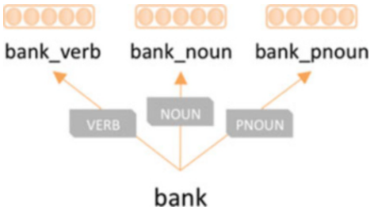
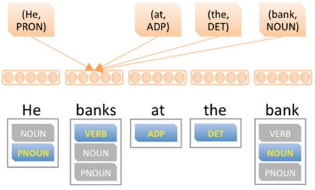

One of the limits of word2vec is polysemy, which means that one word
could have multiple meanings or senses. For example, the word "bank"
could be a verb meaning "do financial work" or a noun meaning "financial
institution". And this problem is known in NLP by the name of
"word-sense disambiguation". In 2015, Andrew Trask proposed a model in
his paper: [Sense2Vec - A Fast And Accurate Method For Word Sense
Disambiguation In Neural Word
Embeddings.](https://arxiv.org/pdf/1511.06388.pdf) called "sense2vec".

Sense2vec is a simple method to achieve word-sense disambiguation that
leverages supervised labeling such as part-of-speech. The sense2vec
model can learn different word senses of this word by combining a
single-sense embedding model with POS labels as shown in the following
figure:

    

Given a corpus, sense2vec will create a new corpus for each word for
each sense by concatenating a word with its POS label. The new corpus is
then trained using word2vec's CBOW or skip-gram to create word
embeddings that incorporate word sense (as it relates to their POS
usage) as shown in the following figure:

    

TO BE CONTINUED...