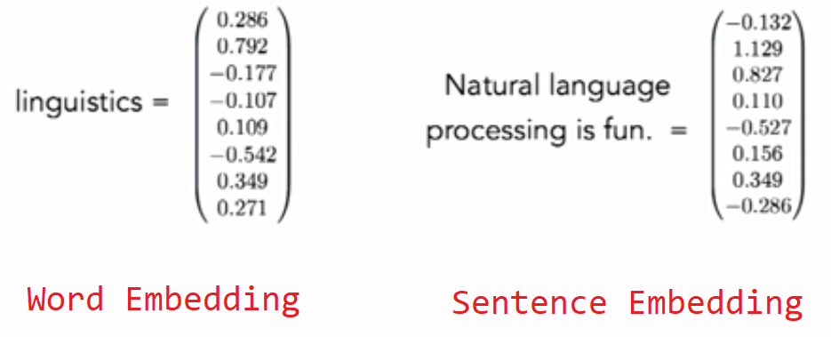
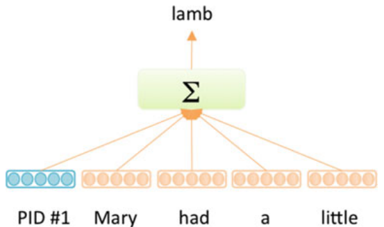

Here, we are going to talk about an important issue that tried to use
the Word Embedding to produce a sentence embedding. By sentence
embedding, we mean to provide a vector of $d$ length that has the
meaning of the sentence in a numerical form; the same form as we did
with word embedding.

    

Following this approach, we could be able to found similarity between
two sentences that has similar meaning. And this could give us some
superiority over Cosine Similarity which determines the similarity bases
on the common words. Using two sentences like "Mexico wishes to
guarantee citizen's safety" and "Mexico intends to avoid more violence"
will be not that similar using Cosine Similarity even though they are
pretty similar in the meaning. And two sentences like "Iranians Vote in
Presidential Election" and "Keita Wins Mali Presidential Election" will
be very similar using cosine similarity although they are not similar in
the meaning.

Le and Mikolov from Google, in their paper: "[Distributed
Representations of Sentences and
Documents](https://arxiv.org/pdf/1405.4053.pdf)" published in 2014,
proposed different techniques for Sentence Embedding as we are going to
discuss below:

Bag-of-Words (BoW)
------------------

This is the simplest method of which we can covert the word embedding
vectors into sentence embedding vector. In this method we get the
**average** of the words vectors that form the sentence. So, the
sentence embedding vector of "Natural Language Processing" is:

$$v\left( \text{Natural Language Processing} \right) = \frac{v\left( \text{Natural} \right) + v\left( \text{Language} \right) + v\left( \text{Processing} \right)}{3}$$

But this method neglects a lot of information like the sequence of the
words and that might give false results. So, for example the sentence
"You are going there to teach not to play." will have the same sentence
embedding as "You are going there to play not to each." even though they
are exactly the opposite.

Distributed Bag-of-Words (DBoW)
-------------------------------

Le and Mikolov from Google, in their paper "[Distributed Representations
of Sentences and Documents](https://arxiv.org/pdf/1405.4053.pdf)"
published in 2014, proposed an distributed bag-of-words (DBOW) which
used only the paragraph context vector to predict the words in the
paragraph. This simple model is analogous to the skip-gram version of
word2vec, except the paragraph vector is used to predict all the words
paragraph instead of using the target word to predict the context words.
As in the skip-gram model, DBOW is very computationally and memory
efficient. Empirical results have shown that both DM and DBOW outperform
bag-of-words and bag-of-n-gram models for text representations.
Furthermore, averaging the DM and DBOW vector representations often
yields the best performance overall.

    

doc2vec
-------

The model generates fixed-length feature representations from variable
length pieces of text, making it useful for application to sentences,
paragraphs, sections, or entire documents. The key to the approach is to
associate every paragraph with a unique paragraph vector $u^{i}$, which
is averaged with the word vectors $w_{j}^{i}$ of the $J$ words in the
paragraph to yield a representation of the paragraph $p^{i}$:

$$p^{i} = u^{i} + \sum_{j = 1}^{J}w_{j}^{i}$$

The paragraph vector ui can be thought of acting as a memory that
remembers word order context. During training, a sliding window of
context words $C$ and the paragraph vector $p^{i}$ are used to predict
the next word in the paragraph context. Both paragraph vectors and word
vectors are trained via backpropagation. While the paragraph vector is
unique to each paragraph and shared across all contexts generated from
the same paragraph, the word vectors are shared across the entire
corpus. It is notable that the

    

<u><strong>Later Check</strong></u>:

There is a famous paper published by **Sanjeev Arora**, **Yingyn Liang**, and
**Tengyu Ma**, who are a group of researchers at Princeton, 
and they call it "[A simple but Tough-to-beat Baseline for Sentence
Embedding](https://openreview.net/pdf?id=SyK00v5xx)".
