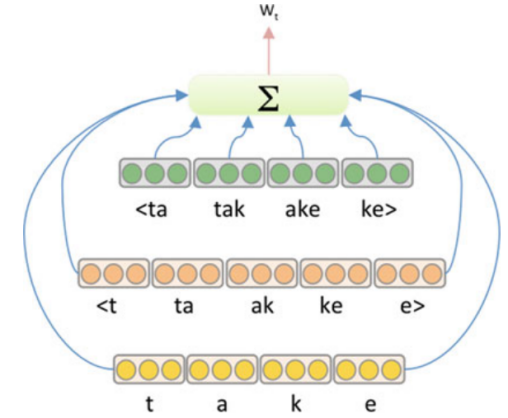

Methods such as word2vec or GloVe ignore the internal structure of words
and associate each word (or word sense) to a separate vector
representation. For morphologically rich languages, there may be a
significant number of rare word forms such that either a very large
vocabulary must be maintained or a significant number of words are
treated as out-of-vocabulary (OOV).

As previously stated, out-of-vocabulary words can significantly impact
performance due to the loss of context from rare words. An approach that
can help deal with this limitation is the use of subword embeddings
proposed by this paper: "[Enriching Word Vectors with Subword
Information](https://arxiv.org/pdf/1607.04606.pdf)", where vector
representations $z_{g}$ are associated with character n-grams *g* and
words $w_{i}$ are represented by the sum of the n-gram vectors:

$$w_{i} = \sum_{g \in \mathbb{G}_{w}}^{}z_{g}$$

For instance, the vector for the word "take" consists of the sum of the
vectors for the n-grams {t, a, k, e, \<t, ta, ke, , e\>, \<ta, tak, ake,
ke\>} when $n \in \lbrack 1,2,3\rbrack$ as show in the following figure:

    

As n-grams are shared across words, this allows for representation of
even unseen words since an OOV word will still consist of n-grams that
will have representations. Subword embeddings can significantly boost
NLP tasks such as language modeling and text classification.

TO BE CONTINUED...