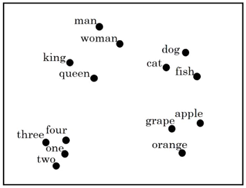

One of the popular things to do with word embedding, is to take this
N-dimensional data and embed it in a two-dimensional space so that we
can visualize them. The most common algorithm for doing this is the
t-SNE algorithm created by **Laurens van der Maaten** and **Geoffrey
Hinton** in 2008 and published in this paper: [Visualizing data using
t-SNE](https://www.cs.toronto.edu/~hinton/absps/tsne.pdf).

t-SNE stands for t-distributed Stochastic Neighbor Embedding which is a
machine learning algorithm for visualization, often used to visualize
high-level representations learned by an artificial neural network,
developed .

    

And if you look at one of these embeddings, you find that words like
"man" and "woman" tend to get grouped together, "king" and "queen" tend
to get grouped together, and these four are the people which tends to
get grouped together. "dog", "cat" and "fish" are animals which can get
grouped together. Fruits will tend to be close to each other. Numbers
like "one", "two", "three", "four", will be close to each other.

TO BE CONTINUED...