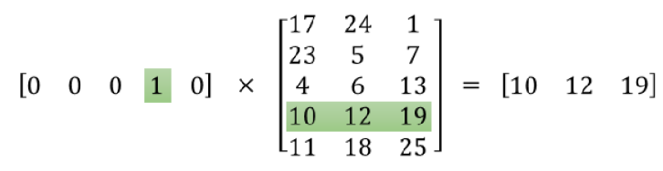

Word2Vec stands for "word-to-vector" is a model architecture created by
Tomáš Mikolov from Google in 2013 and published in the paper: [Efficient
Estimation of Word Representations in Vector
Space](https://arxiv.org/pdf/1301.3781.pdf). This model aims at
computing continuous vector representations of words from very large
data sets.

It uses a principle in distributional semantics that says that "the
word's meaning is given by the words that frequently appear close-by".
And this is the main idea behind "word2vec". Also, this means that
similar words will appear in similar context which will make their
vectors similar and that's a great feature in word2vec as we are going
to see later.

The way we define these vectors is actually a trick you may have seen
elsewhere in machine learning. We're going to train a simple neural
network with a single hidden layer to perform a certain task, but then
we're not actually going to use that neural network for the task we
trained it on! Instead, the goal is actually just to learn the weights
of the hidden layer, these weights are actually the "word vectors" that
we're trying to learn.

So now we need to talk about this "fake" task that we're going to build
the neural network to perform, and then we'll come back later to how
this indirectly gives us those word vectors that we are really after.
We're going to train the neural network to be a language model. To be
more specific, the model should do the following; given nearby words
(before and after), the model should predict the most probable word that
fits. At first, it will be random but after a few iterations over the
training data it will produce more appropriate results. When we say
\"nearby\", there is actually a \"window size\" parameter to the
algorithm. A typical window size might be 5, meaning 5 words behind and
5 words ahead (10 in total).

Word2vec comes in two flavors, the Continuous Bag-of-Words model (CBOW)
and the Skip-Gram model. Algorithmically, these models are similar,
except for only one thing which is <u>the shape of the input layer and the
output layer</u>. As CBOW predicts target words from source context
words, while the skip-gram does the inverse and predicts source
context-words from the target words.

This inversion might seem like an arbitrary choice, but statistically it
has the effect that CBOW smooths over a lot of the distributional
information (by treating an entire context as one observation). For the
most part, this turns out to be a useful thing for smaller datasets.
However, skip-gram treats each context-target pair as a new observation,
and this tends to do better when we have larger datasets.

I know this seems difficult, so let's see the Skip-Gram and CBOW models
in more details.

Skip-Gram
---------

Skip-Gram model is a model and how to prepare the training data. In
Skip-Gram, we'll train the neural network by feeding it word pairs found
in our training documents. The below example shows some of the training
samples (word pairs) we would take from the sentence "The quick brown
fox jumps over the lazy dog". Here, we've used a small window size of
$2$ just for the example. A more reasonable size would be $5$ or more.
The word highlighted in blue is the input word (center) and the other
two on the left and right are the context words, each is called
(target).

    

The network is going to learn the statistics from the number of times
each pairing shows up. So, for example, the network is probably going to
get many more training samples of ("Soviet", "Union") than it is of
("Soviet", "Apple"). When the training is finished, if you give it the
word "Soviet" as input, then it will output a much higher probability
for "Union" or "Russia" than it will for "Apple".

Now, how is this all represented? First of all, we know we can't feed a
word just as a text string to a neural network, so we need a way to
represent the words to the network. To do this, we first build a
vocabulary of words from our training documents, let's say we have a
vocabulary of $10,000$ unique words. Then, we're going to represent the
input word as a one-hot vector. This vector will have $10,000$
components (one for every word in our vocabulary) and we'll place a $1$
in the position corresponding to the word, and $0$s in all of the other
positions.

The output of the network is a single vector (also with $10,000$
components) containing, for every word in our vocabulary, the
probability that a randomly selected nearby word is that vocabulary
word. Here's the architecture of our neural network, noting that <u>there
is no activation function on the hidden layer neurons, but the output
neurons use Softmax</u>:

    

When training this network on word pairs, the input is a one-hot vector
representing the input word and the training output is also a one-hot
vector representing the output word. But when we evaluate the trained
network on an input word, the output vector will actually be a
probability distribution (i.e., a bunch of floating point values, not a
one-hot vector).

For our example, we're going to say that we're learning word vectors of
$300$ features. So the hidden layer is going to be represented by a
weight matrix of $10,000$ rows (one for every word in our vocabulary)
and $300$ columns (one for every hidden neuron). "$300$ features" is
what Google used in their published model trained on the Google news
dataset, but we can tune this number if we want; we can try different
values and see what yields the best results. <u>As a matter of fact, the
weights of the hidden layer after finishing training, is the word
embedding we are looking for</u>. This matrix is often called
"Embedding Matrix"

    

So, the end goal of all of this is really just to learn this hidden
layer weight matrix, the output layer we'll just toss when we're done!
Let's get back, though, to working through the definition of this model
that we're going to train. The one-hot vector is almost all zeros,
what's the effect of that? If we multiply a $1 \times 10,000$ one-hot
vector by a $10,000 \times 300$ matrix, it will effectively just select
the matrix row corresponding to the 1. This means that the hidden layer
of this model is really just operating as a lookup table.

Here's a small example to give you a visual:

    

The output layer is a Softmax regression classifier of $10,000$ neurons.
Each output neuron has a weight vector which it multiplies against the
word vector from the hidden layer, then it applies the Softmax
activation function. Here's the formula that we are going to follow to
train this neural network:

$$p\left( \text{target} \middle| \text{context} \right) = \frac{\exp\left( u_{\text{target}}^{T}.v_{\text{context}} \right)}{\sum_{i = 1}^{V}{\exp\left( u_{i}^{T}.v_{\text{context}} \right)}}$$

Such that:

-   $\text{target}$ is the target word.

-   $\text{target}$ is the context word.

-   $V$ is the number of words in our vocabulary.

-   $u_{\text{target}}$ refers to the word vector of the target word.
    Its shape should be $d \times 1$ where $d$ is the number of
    features/dimensions ($300$ in our case). $u_{\text{target}}^{T}$
    shape should be $1 \times d$.

-   $v_{\text{context}}$ refers to the output-layer vector (<u><strong>outside
    vector</strong></u>) of the context word. Its shape should be
    $1 \times d$ where $d$ is the number of features ($300$ in our
    case).

So, as we can see each word has two representations in our Word2Vec
model; one when it's a target word and another when it's a context word.
Here's an illustration of calculating the output of the output neuron
for an input word.

    

If two different words have very similar contexts, then our model needs
to output very similar results for these two words. So, if two words
have similar contexts, then our network is motivated to learn similar
word vectors for these two words. And what does it mean for two words to
have similar contexts? I think we could expect that synonyms like
"intelligent" and "smart" would have very similar contexts. Or that
words that are related, like "engine" and "transmission", would probably
have similar contexts as well. This can also handle stemming for us --
the network will likely learn similar word vectors for the words "ant"
and "ants" because these should have similar contexts. The following
formula is cost function that we are going to use to learn our model:

$$J = \frac{- 1}{S}\sum_{i = 1}^{S}\left( \sum_{- m \leq j \leq m,j \neq 0}^{}{\log\left( p\left( w_{i + j} \middle| w_{i} \right) \right)} \right)$$

Such as that:

-   $J$ represents the objective function.

-   $S$ represents the total number of sentences that we are going to
    train our model upon.

-   $m$ is the window size.

-   $w_{i}$ is the context word.

-   $w_{j + i}$ is the target word.

-   $p\left( w_{i + j} \middle| w_{i} \right)$ represents the probability of
    the target word given the context word. In other words, it's equal to:

$$p\left( \text{target} \middle| \text{context} \right) = \frac{\exp\left( u_{\text{target}}^{T}.v_{\text{context}} \right)}{\sum_{i = 1}^{V}{\exp\left( u_{i}^{T}.v_{\text{context}} \right)}}$$

You may have noticed that the skip-gram neural network contains a huge
number of weights. For our example with $300$ features and a vocab of
$10,000$ words, that's $3,000,000$ weights in the hidden layer and
output layer each! Running gradient descent on a neural network that
large is going to be slow. And to make matters better, you need a huge
amount of training data in order to tune that many weights and avoid
over-fitting. Millions of weights times billions of training samples
means that training this model is going to be a beast. The authors of
Word2Vec addressed these issues in their second paper: "[Distributed
Representations of Words and Phrases and their
Compositionality](http://arxiv.org/pdf/1310.4546.pdf)".

There are three innovations in this second paper that made training a
bit faster:

-   Treating common word pairs or phrases as single "words" in their model.

-   Subsampling frequent words to decrease the number of training examples.

-   Modifying the optimization objective with a technique they called
    "Negative Sampling", which causes each training sample to update
    only a small percentage of the model's weights. It's worth noting
    that subsampling frequent words and applying Negative Sampling not
    only reduced the compute burden of the training process, but also
    improved the quality of their resulting word vectors as well.

Let's talk about these three modifications with more details:

### Word Pairs

Here, we are going to explain the first innovation (or modification)
that the authors of Word2Vec have produced in their second paper. The
authors pointed out that a word pair like "Boston Globe" (a newspaper)
or "Chicago Bulls" (a Basketball Team) has a much different meaning than
the individual words "Chicago" and "Bulls". So it makes sense to treat
them as a single word with its own word vector representation. We can
see the results in their published model, which was trained on $100$
billion words from a Google News dataset. The addition of phrases to the
model swelled the vocabulary size to $3$ million words!

But the question here is "how did they detect these word-pairs?". The
answer is very straight forward. Each pass of their model only looks at
combinations of two words, but you can run it multiple times to get
longer phrases. So, the first pass will pick up the phrase "New_York",
and then running it again will pick up "New_York_City" as a combination
of "New_York" and "City" and so on. The tool counts the number of times
each combination of two words appears in the training text, and then
these counts are used in an equation to determine which word
combinations to turn into word-pair.

The equation is designed to pay attention to the word-pairs that occur
together often relative to the number of individual occurrences. It also
favors pairs made of infrequent words in order to avoid making phrases
out of common words like "and the" or "this is".

### Subsampling Frequent Words 

We have seen how training samples were created from the source text. The
below example shows some of the training samples (word pairs) we would
take from the sentence "The quick brown fox jumps over the lazy dog."
using a small window size of 2. The word highlighted in blue is the
input word:

    

But, in this representation we have two problems with <u>common words</u> like
"the":

-   When looking at word pairs, ("fox", "the") doesn't tell us much
    about the meaning of "fox". "the" appears in the context of pretty
    much every word.

-   We will have many more samples of ("the", ...) than we need to learn
    a good vector for "the".

Word2Vec implements a "subsampling" scheme to address this. They
implemented an equation for calculating a probability with which to keep
a given word in the vocabulary. This probability that we cut the word is
related to the word's frequency as we can see:

$$P\left( w_{i} \right) = \frac{\left( \sqrt{\frac{z\left( w_{i} \right)}{s}} + 1 \right) \ast s}{z\left( w_{i} \right)}$$

Where $w_{i}$ represent the word, $z\left( w_{i} \right)$ represents the
word frequency ratio. For example, if the word "peanut" occurs $1,000$
times in a one-billion-word corpus, then
$z\left( ‘peanut’ \right) = \frac{10^{3}}{10^{9}} = 10^{- 6}$. And $s$
is the 'sampling rate' which is a hyper-parameter that controls how much
subsampling occurs, and the default value is $0.001$. Smaller values of
'sampling rate' mean words are less likely to be kept. And finally,
$P\left( w_{i} \right)$ represents the probability of keeping the word
$w_{i}$.

Now, if we have a window size of 10, and we remove a specific instance
of "the" from our text. Then, we will train on the remaining words, as
"the" will not appear in any of their context windows. And we'll have 10
fewer training samples where "the" is the input word.

### Negative Sampling

Training a neural network means taking a training example and adjusting
all of the neuron weights slightly so that it predicts that training
sample more accurately. In other words, each training sample will tweak
all of the weights in the neural network. As we discussed above, the
size of our word vocabulary means that our Skip-Gram neural network has
a tremendous number of weights, all of which would be updated slightly
by every one of our billions of training samples!

Negative sampling addresses this by having each training sample only
modify a small percentage of the weights, rather than all of them.
Here's how it works:

-   When training the network on the word pair ("fox", "quick"), we will
    generate another $k$ words randomly from the vocabulary. These $k$
    words are called **negative samples**. The paper says that selecting
    5-20 words works well for smaller datasets, and you can get away
    with only 2-5 words for large datasets.

    

As we can see, here we have generated $4$ words randomly from the
vocabulary and they are ("king", "orange", "box", and "the"). As we can
see, the word "the" exists in the context of the word "quick", but it's
ok.

-   After that, we will multiply the Embedding Matrix $E$ by the one-hot
    vector of the five words producing embedding vector:

$$O_{\text{fox}} \odot E = e_{\text{fox}},O_{\text{quick}} \odot E = e_{\text{quick}},O_{\text{king}} \odot E = e_{\text{king}}$$

$$O_{\text{orange}} \odot E = e_{\text{orange}},O_{\text{box}} \odot E = e_{\text{box}},O_{the} \odot E = e_{the}$$

-   Finally, change the problem into a classification problem where the
    input is the word-pairs; and the output is either 1 or zero.

Recall that the output layer of our model has a weight matrix of
$300 \times 10,000$. So, we will just be updating the weights for our
positive word ("quick"), plus the weights for $4$ other words that we
want to output 0. That's a total of $5$ output neurons, and $1,500$
weight values total. That's only $0.06\text{\%}$ of the $3$ Million
weights in the output layer!

Choosing the "negative samples" randomly isn't that efficient because
the probability of a common word like "and" to be chosen is higher than
any other word. Instead, we use a "unigram distribution" where the
probability for selecting a word as a negative sample is related to its
frequency, with more frequent words being more likely to be selected as
negative samples as we can see in the following formula:

$$P\left( w_{i} \right) = \frac{f\left( w_{i} \right)^{\frac{3}{4}}}{\sum_{j = 0}^{n}\left( f\left( w_{i} \right)^{\frac{3}{4}} \right)}$$

Where $P\left( w_{i} \right)$ represents the probability of a word
$w_{i}$ to be selected as a negative sample. As we can see, each word is
given a weight equal to its frequency (word count)
$f\left( w_{i} \right)$ raised to the $\frac{3}{4}$ power. The decision
to raise the frequency to the $\frac{3}{4}$ power appears to be
experiential

$$J = \frac{1}{S}\sum_{i = 1}^{S}\left( \sum_{- m \leq j \leq m,j \neq 0}^{}{\log\left( p\left( w_{i + j} \middle| w_{i} \right) \right)} \right)$$

CBOW
----

We have explained the Skip-Gram model, now let's explore the other
Word2Vec model which is the Continuous Bag-of-Words (CBOW) model. As we
have said before, the only difference between Skip-Gram and CBOW is the
shape of the input and output layer of the network. So, if we understand
the Skip-Gram model then the CBOW model should be quite straight-forward
because in many ways they are mirror images of each other.

To understand that model, let's consider having the following sentence
"the quick brown fox jumps over the lazy dog.". Here, we are going to
use a small window size of $2$ just for the example. A more reasonable
size would be $5$ or more. The word highlighted in blue is the output
word (target).

    

Unlike the Skip-Gram, the continuous bag of words model context is
represented by multiple words for a given target word. For example, we
could use "The quick fox jumps" as context words for "brown" as the
target word. This calls for a modification to the neural network
architecture. The modification, shown below, consists of replicating the
input to hidden layer connections $C$ times which represents the window
size of the context (four in our case):

    

Like the Skip-Gram, we will use a one-hot vector to encode our
words. This vector will have $10,000$ components (one for every word in
our vocabulary). The output of the network is a single vector (also with
10,000 components) containing, for every word in our vocabulary, the
probability that a randomly selected nearby word is that vocabulary
word. Here's the architecture of our neural network, noting that <u>there
is no activation function on the hidden layer neurons, but the output
neurons use Softmax</u>. Everything else will be exactly as the
Skip-Gram model.
